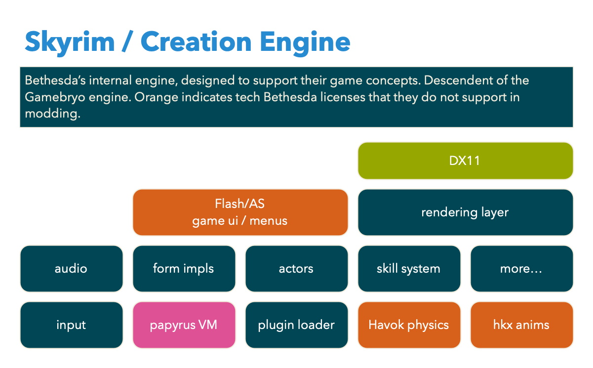

# [fit] How I spent my

# [fit] **summer vacation**

## [fit] or, my adventure with Skyrim modding

^ I tried to do a WASM startup last here. We had some fun ideas, but we went to pitch VCs at exactly the moment every single one of them aligned like iron filings near a magnet toward Large Language Models instead of cryptocurrencies. So we gave up. I went to sit at home and sulk for a while. I don't enjoy sulking, so I thought, well, why don't I play some video games? Specifically, I went for a video game comfort food. I went for Skyrim.

---

# [fit] **fus-ro-dah!**

# [fit] What's **Skyrim** anyway?

^ Skyrim is an award-winning 2011 game by Bethesda Game Studio, the fifth in their Elder Scrolls series of role-playing games. It has an amazing sound track, middling graphics, and some fascinating lore. It's been released on PC plus every game console there is. There's a VR version. Game director Todd Howard would release it on your toaster if he could.

^ Skyrim is a region of the larger Elder Scrolls world, roughly equivalent to Scandinavia with a Viking-ish civilization. There's a civil war in progress as a larger human Empire falls apart because of what the player did in the previous two Elder Scrolls games. To make things worse, a dragon surprises everybody by existing and destroying a town.

^ It opens kinda like this.

---

^ What's Skyrim? Here is its opening sequence. The wipe goes from vanilla Skyrim to what my current modlist looks like. I think Lokir of Rorikstead is a bit too cute for the character. https://youtu.be/uvetY44dFIs

---

# [fit] **Skyrim**

# [fit] == mods

^ Mods change the look a lot, huh? If you've been playing Fallout again recently because of the TV show, you know that it goes further than this. Bethesda games overall are very moddable.

---

# [fit] Skyrim is the **sweet spot**

- the game is beloved **but**…
- the rendering is terrible
- the bugs are bad
- the UI was designed for consoles
- but all of this can be fixed…
- because the game is moddable!

---

# [fit] I built a **gigantic**

# [fit] list of **2000+** mods

^ So let's go back to my sulk-ending period of Skyrim modding. I built a ridiculous modlist for myself, everything I'd always wanted to play with. It was something like 2000 plugins before I started trying to winnow it down.

---

# [fit] **But…**

I couldn't find a hotkeys mod that wasn't

a. slow
b. buggy
c. both buggy _and_ slow

Except for one HUD mod that worked but wasn't quite right. So I forked it.

^ Skyrim has a LOT of items in it, and mods add more. You can end up having to dive into menus to eat food, drink potions, and switch weapons a lot. Hotkeys mods make this better. HUD + hotkey mods show you what you've got equipped. I wanted something specific.

---

^ This is what I wanted: to set up lists of things that I could cycle through by tapping a single button. So for the right hand I could swap from sword to bow to a spell to a gigantic axe back to sword by tapping one button for the right hand. If you've played a Souls game with a controller, that would be the right direction button. Same for left hand items, then potions and food, then shouts. This saves you menu-diving, which is kinda unimmersive.

---

# [fit] Time to learn how

# [fit] to **write** mods

^ not just use them

---

# [fit] a rapid intro to

# [fit] **Creation Engine**

# [fit] modding

---

# [fit] the Creation Engine is **designed** for modding

Modding is essential to Bethesda's own workflow.

- The games are developed with the same tool they distribute to modders.
- (They do hack out proprietary libraries.)
- Official DLCs use the same mechanisms as mods to update game data.

^ The engine itself has nowhere near the wow factor of Unreal Engine. It has all the basics, for sure, but it doesn't have high frame rates or raytracing. Bethesda made all of its trade-offs differently.

---

# [fit] the game data is **designed** for overlays

- "form" is the unit of game data: a sound, an armor component, a skill, etc
- form types are implemented in the game engine
- plugins define new form records or override existing form records
- game engine loads plugins in a user-controlled order
- **last-loaded** form record wins
- last-loaded asset archive wins; **loose files** > archives

---

---

# [fit] the file **formats**

- slowly evolving for 20 years
- fully reverse-engineered
- community toolset is less buggy than Bethesda's provided tools
- no seriously: `xEdit` fixes problems with plugin data generated by the CreationKit
- complex workflows are supported

---

---

# [fit] **ActionScript**

- UI is all Scaleform
- this is a custom Flash engine designed for embedding in games
- FromSoft games also use it, even though it's been dead for a few years
- limited to only UI use cases and a PITA to work with

---

# [fit] **Papyrus** scripts

- Bethesda's scripting language with hooks into the engine
- it's compiled but…
- it's pretty slow
- it hooks into the game engine to affect game state
- the game itself is implemented in papyrus

---

# [fit] Fix and extend via

# [fit] **reverse engineering**

^ Game reverse engineering has a long and storied history.

---

# [fit] SKSE, F4SE, SFSE **script extenders**

The "script extender" series of mods originally extended Papyrus by hooking into more game functions. It's now important as a native-code plugin loader. It also provides reliable ways for mods to store save data alongside game data.

This is the basis of UI replacement mods like SkyUI. Todd Howard says SkyUI is his favorite Skyrim mod, so Bethesda knows this exists.

---

# [fit] RE projects are **organized** & **professional**

- they're serious C++ experts
- with a side helping of RE & x86 assembly experience
- RE tools in use: mostly IDA, some Ghidra (the free NSA RE tool)
- they do work to reduce their own toil

^ Before Starfield turned out to be disappointing, with a fundamentally flawed engine, the RE community had made and executed on a plan to coordinate on working on archive format changes, plugin format changes, new form records, and so on. A working script extender was available in record time. The community also unlocked plugin loading, which allowed modding to take place immediately. (Bethesda still has not released the Starfield Creation kit. The RE community believes this is because they figured out how badly they'd broken modding with this engine release via form item layering screwups.)

---

# [fit] example: **Address Library**

- designed to make coping with engine updates easier
- changed vtable offsets are RE-ed at least partially with tools like [addresslibgen](https://github.com/Ryan-rsm-McKenzie/fallout4-addresslibgen)
- the offset library mod is updated
- mod authors don't have to do anything
- players need download only one update

^ During a period when Skyrim was getting frequent releases, the RE community invented a way for SKSE plugin mods to look up game offsets on the fly, from a library that provides offsets for a number of versions.

---

# [fit] CommonLibSSE-NG aka **CLib**

- a reverse-engineered C++ library
- everything we understand about the game engine and its classes
- field structure/sizes and vtables; with types if a human has investigated
- with tools for offset look-up
- requires SKSE at runtime, not at compile time-- completely separate code & far more extensive
- supports _all_ known game builds

---

# [fit] **xbyak** jitted assembly

- injects code at runtime
- allows you to hook functions
- can trampoline from original function to your code and back
- CLib wraps all this up nicely so I didn't have to learn this

---

# [fit] What **native-code** mods do

- call methods to get game information/state/events
- insert your own functions before or after existing game functions
- replace game functions entirely (more rarely)
- example: my mod intercepts menu selection events, inventory changes
- it also grabs the DX11 render context so it can draw a HUD

---

^ If a block diagram looks kinda like this...

---

^ This is which parts of the game engine have been reverse engineered. Anything a modder wanted to replace or fix, ever-growing.

---

# [fit] Back to my forked **HUD mod**

- it's a CommonLibSSE mod: C++
- it uses **imgui** to draw UI not Flash
- this is why it was fast
- but other design decisions made it flakey
- and I had an idea about how to do menu interactions

I can fix it, right?

---

# [fit] a **learning** project

- modern C++
- Windows development
- imgui
- Skyrim itself
- could I learn about Rust/C++ interop?

---

# [fit] how **hard** can it be?

^ cue A-Team theme song

---

# [fit] say hi to **Soulsy HUD**

^ I can no longer imagine playing the game without it. https://youtu.be/l4cxzh4-Feg

---

---

---

# [fit] division of **labor**

- C++: SKSE plugin responsibilities
- C++: source of game state info
- C++: render loop
- Rust: controller for HUD state (all app logic)
- Rust: layout parsing & settings enforcement
- Rust: unified logging

---

# [fit] So how hard **was** it?

Harder than I thought, but not the way I expected.

- Windows strings were a pain until I understood them
- Skyrim internals are not always sensible
- mod interactions made the problem more complex than expected
- had lots of bugs for a long time until it fell together
- players asked for far more features than I thought I wanted (but they were right)

---

# [fit] understanding **Skyrim** itself

- SKSE and CLib are undocumented
- CLib is more methodical but much larger
- found my favorite C++ mod authors and read all of their code
- $%@! extra data & inventory what the what now?
- a lot of trial and error

^ I cannot overstate the importance of the skill of reading undocumented code and figuring out what it does.

---

# [fit] **Windows** development

This was a surprising challenge to me. I had not done a lot of development on Windows through my career, so I had to learn how to cope with a new ecosystem.

- `CMake` - I had to write my own CMake files because I was linking to Rust
- `vcpkg` - for C++ libraries
- Visual Studio & `msvc` flag conventions

^ Redmond is a different developer country. I've had an adjustment period here to the JVM, which is a different ecosystem with its own local customs and trivia, but the adjustment to Redmondland was bigger.

---

# [fit] **Command-line** workflows

- developer tools are better on MacOS & Linux (familiarity bias?)
- found a Windows terminal app that isn't awful (wezterm)
- WSL saved me in the end, because I had `bash`
- forced back to VSCode instead of my preferred editor
- all the Rust dev can be done on MacOS
- implemented Rust tests to avoid needing to link to CLib

^ It was a pretty bad adjustment, to be honest. I really loathe editing code in Visual Studio, which is amazing to me because of how many people use these tools worldwide.

---

# [fit] **Strings** are (often) annoying

- Rust is natively `utf-8`; `String` type and `&str` borrowed data type
- `std::ffi::{OsString, OsStr}` are host OS equivalents
- Windows OS strings are wide chars (16 bytes); file paths!
- Skyrim uses `iso-8859-1` internally
- Scaleform/Flash translation strings are `UCS-2`
- player crashes with encodings until I learned all this

^ String handling in lower-level languages are traditionally tricky because you have to think about ownership of the byte structure behind the string. That was not a problem in this project, but encodings were. UCS-2 is a fixed-width 16 byte encoding that is pretty old-- I had to cope. This is an example of how unfamiliarity with Windows presented me with a learning curve. It's trivia I had to pack into my brain.

---

# [fit] Modern C++ **>** older C++

- all mod cons in the std library
- ergonomics are better
- official documentation is terrible
- null-pointer access still plagued me
- no _contract_ about when a pointer can be null in CLib

^ Better but not great. 90% of my crashes were null pointers. The remainder was a combo of invalid utf-8 in Rust plus a couple of stray `todo!()` macros + one unwise `unwrap()`.

---

# [fit] So how **is** the Rust/C++ **interop** story?

Exactly as good as advertised.

- near zero cost
- tools are mature and well-tested
- [bindgen](https://lib.rs/crates/bindgen) is one approach
- [cxx](https://cxx.rs) was the one I used

---

# [fit] **cxx** codegen for a safer subset of interop

- safe in the Rust sense: no games with memory; compiler can check
- generates bindings for the functions you want on either side
- C++ can call Rust & vice versa
- not as complete as `bindgen`
- `char*` not supported, for example (impossible to make safe)
- but great interop for utf8 strings and vectors

---

# [fit] **[lib.rs](https://github.com/ceejbot/soulsy/blob/latest/src/lib.rs)** defines the bridge

Let's look at some code briefly!

^ show lib.rs here

---

# [fit] plugins could be **100% Rust**

- currently 68.5% Rust
- official Rust bindings for nearly all Windows APIs
- **bindgen** is the path here
- would need to learn xbyak
- CLib is a moving target
- I got a job instead of diving into this
- gotta have a budget for graphics cards, you know?

^ Theoretically, I could reduce the C++ down to Rust bindings to CommonLibSSE-NG and the SKSE plugin entry point, plus some xbyak glue. Imgui has Rust bindings. DX11 has Rust bindings, so I can create textures for it. The way I chose was the least work-- I could focus on the application itself.

---

# [fit] **reworks** along the way

I found myself having persistent trouble with some design decisions.

- made some messes initially with cycle advancing
- careful work documenting how next-weapon decisions are made
- could handle grip-switch mods easily once I got this right
- loading and rasterizing svgs
- categorizing the many, many mod-added items

^ The actual task of advancing cycles with edge case handling was a lot of careful work. I remember what is in each hand so advancing either hand and going from 2-hander to 1-hander restores what was in the other hand. This feels right in-game, but has lots of edge cases.

---

# [fit] nanosvg ➜ **resvg**

- C++ to [Rust](https://lib.rs/crates/resvg)
- but really, minimal spec support to extensive spec support
- implemented lazy-loading at the same time
- no real memory pressure, but I like being thrifty

^ People kept reporting bugs with svgs that worked in Flash but didn't in Soulsy. It was always because the svg was actually a PNG in a base64 trenchcoat, which is allowed by the spec but not supported by nanosvg.

---

# [fit] object **categorization** rework

- mod-added objects weren't getting the right icons
- both the C++ and Rust sides of this were awful
- so I started using object keywords to categorize
- the mod [Object Categorization Framework](https://www.nexusmods.com/skyrimspecialedition/mods/81469) adds keywords to thousands of items
- for a few mods, I distribute keywords myself using [Keyword Item Distributor](https://www.nexusmods.com/skyrimspecialedition/mods/55728)

---

# [fit] keep it **fast**

Two facets of performance:

- perceived input latency
- frame rate cost of the render loop

Using a native-code SKSE plugin means doing both is _possible_, though bad programming can mess it up.

^ Writing this as a native-code SKSE plugin obliterated the input latency problem. Imgui means it can be visually fast. This is why I started with the HUD mod I picked.

---

# [fit] the **render loop** has to be tight

- reduced branching in the tight loop
- made all layout decisions at layout load time where possible
- internal structures are quite different from the serialized player-editable structures as a result
- mod precalculates and loads data for items that will be drawn

^ This was a lot of fun to do. Not the kind of programming I get a chance to do much of these days.

---

# [fit] Supporting **cli** projects

I wrote Rust cli tools to help:

- `md2nexus`: convert markdown to NexusMod's BBCode (which is awful)
- `mcm-meta-helper`: manage translation string files; UCS-2 is hard to work with
- `priority-sync`: sync mod order across MO2 profiles; for testing with many setups to repro player problems

^ All of these are Rust cli tools. The third one is notable because there is a python plugin for Mod Organizer 2 that does this, but it's extremely slow and buggy. I wrote a ridiculously fast tool that does something simpler but easier to make reliable. All of these are in the `ceejbot` github, btw, if you want to see how nice writing CLIs in Rust is, thanks to the `clap` crate.

---

# [fit] **leveled up** as a Rust programmer

- extremely comfortable with the language now
- using the type system in more advanced ways (generic associated types, e.g.)
- appreciating more how type systems improve my data design thinking
- thinking about lifetimes improved my C++

---

# [fit] the features I **wanted**

- shouts & powers cycle
- left item cycle: shields, torches, weapons, spells, scrolls
- right item cycle: weapons, spells, two-handers, scrolls
- potion & poison cycle
- a layout defined in a human-readable text file
- minimal to no settings

---

# [fit] the features I **implemented**

- all of what I wanted! plus!
- too many settings
- customizable layouts in TOML, with hot reload in-game
- two custom icon sets
- smart potion selection
- equipment set management
- full controller support

---

# [fit] got to use **many skills**

- product design
- UX design & writing
- user docs + programmer docs
- programming with attention to perf & memory use
- single-process stateful software architecture (not dist systems for once)

^ I have a very particular set of skils, skils I have acquired over a very long career. Skills that make projects like this a joy for me. I am not a graphic designer, but I faked it here. Visual transitions use easing curves; I did my best to polish everything I touched.

---

# [fit] Incredibly **fulfilling** work

- Full control of design but took lots of player input.
- Heard player pain immediately.
- Heard player happiness immediately!
- Could have zero tolerance for tech debt.
- Could meet my own quality standards.
- Feature development was extremely rapid when I got the design right.
- Got exactly the HUD mod I wanted.

^ My own standards for software are much higher than that of most of the startups I've worked for. Most often the ticking clock of company debt means that speed is the only thing that matters and even that is evaluated in a very shallow way. Here I could realize that I'd designed myself into a corner that made feature work hard, and then fix it by rewriting. In the end, this is of course faster than not fixing tech debt.

---

# [fit] What I **learned**

- so much! Skyrim, modern C++, that I can still learn fast when I need to
- Rust > C++ (but they go well together)
- Windows needs a great text editor
- Skyrim is a platform for focused game dev
- Skyrim did in fact fix my bad mood

---

# [fit] **Questions?**

# [fit] github.com/ceejbot/soulsy
